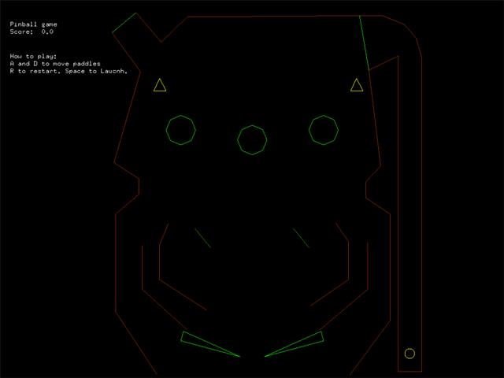
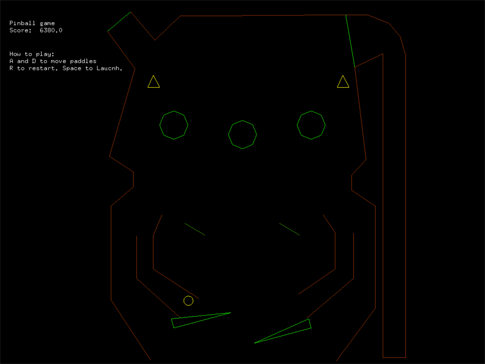

# Pinball – Ubisoft NEXT 2018

A playable pinball game in **C++**. I built it solo for the **Ubisoft NEXT 2018** programming challenge, starting from a bare-bones framework that could only draw lines, print text, read input and play sounds. The object model, the physics and every gameplay element are my own code.



> *20 seconds of real gameplay, recorded straight from the game window.*

**Highlights**
- **Component-based object model** in the style of Unity/Unreal: `GameObject`s composed of `Transform`, `RigidBody` and `Physics` components, found with a templated `getComponent<T>()`.
- **2D physics from scratch**: circle-vs-segment collision, reflection with per-surface restitution, gravity, and flippers driven by torque with clamped angles.
- **7 gameplay elements**, each with its own collision behaviour: flippers, bumpers, teleporters, spinners, one-way gates, targets and a drain.
- **Data-driven table**: the layout is loaded from a text file and edited in a visual in-game editor, which I extended with my new element types.

**Tech:** C++ · OpenGL (freeglut) · DirectSound · Win32 · Visual Studio

---

## The challenge

Ubisoft NEXT is Ubisoft Canada's annual competition for game-development students. Every programming entrant gets the same minimal C++ API: open a window, draw lines, print text, read keyboard/gamepad input and play sounds. Each entrant then has a short, fixed window to build a game on top of it. The 2018 brief was **pinball**.

The starter kit gave me a table made of coloured line segments and an editor for moving them. It had no physics, no game objects and no gameplay; I built all of that.

## Technical breakdown

### Game object and component system
Every object on the table, from the ball to the bumpers, is a `GameObject` that owns a list of components and child objects. Behaviour comes from composition rather than deep inheritance:

```cpp
class GameObject {
    std::vector<GameComponent*> m_components;   // owned
    std::vector<GameObject*>    m_children;     // owned

    template<class T> T* getComponent();         // typed lookup
    virtual void update(float deltaTime);
    virtual void render(CTable* table, ...);
};
```

| Component | Responsibility |
|---|---|
| `TransformComponent` | Position and rotation |
| `RigidBodyComponent` | Velocity, acceleration, angular velocity, gravity |
| `PhysicsComponent` | Collision detection, collision response, applying torque |

A `GameObjectManager` keeps a named registry of the scene and drives `update` and `render` for every object each frame. Adding a new table element means writing one subclass. The manager and the physics code stay unchanged.

### Physics
- **Integration:** semi-implicit Euler. Velocity is updated from acceleration, then position from velocity, with the ball's speed clamped to keep the simulation stable. Gravity only switches on when the ball leaves the plunger.
- **Detection:** circle vs. line segment. I project the ball's centre onto each segment, clamp the projection to the segment, and compare that distance with the ball's radius.
- **Response:** I push the ball out along the contact normal by the overlap, then reflect its velocity: **v′ = e · (v − 2(v·n)n)**. The restitution `e` depends on the surface. Walls absorb energy (`e < 1`) and bumpers add it (`e > 1`), which gives pinball its lively feel.
- **Flippers:** a keypress applies angular acceleration rather than snapping the flipper to an angle. A constant restoring torque pulls the flipper back down, and its rotation is clamped to ±15°. Every frame the flipper's local-space segments are rotated into world space, so the ball collides with the flipper where it actually is mid-swing.

### Gameplay elements
Each element builds its shape from line segments in local space, transforms them into the shared table, and tags them with a **line type**. The physics component switches on that type to decide what the ball does:

| Element | Behaviour | Score |
|---|---|---|
| **Flippers** | Player-controlled, torque-driven | +100 |
| **Mushroom bumpers** | Octagons that kick the ball away hard | +100 |
| **Teleporters** | Warp the ball to the other side of the table | +100 |
| **Spinners** | Rotating bars that score while the ball passes through | +1 per frame |
| **Guards** | One-way gates that only deflect a ball moving in one direction | +1 |
| **Targets** | High-value targets | +10,000 |
| **Drain** | Resets the ball to the plunger and clears the score | – |

It also has a live score HUD and 8-bit sound effects on impact.

### Tooling: table editor
The table layout lives in [`GameTest/table.txt`](GameTest/table.txt). I extended the starter kit's editor with my new line types, so the table could be laid out and tuned visually, and iterated on without recompiling.



## Controls

| Key | Action |
|---|---|
| `Space` | Launch the ball |
| `A` / `D` | Left / right flipper |
| `R` | Reset ball and score |
| `Esc` | Quit |

<details>
<summary><b>Editor controls</b> (launch with <code>-Editor</code>)</summary>

| Input | Action |
|---|---|
| Left click / drag | Select a line or move its endpoints (snaps to nearby points) |
| `Shift` (hold) | Disable snapping and drag a single point |
| `Ctrl` + click | Add a new line |
| `0`–`9` | Change the selected line's type |
| `Delete` | Delete the selected line |
| `Ctrl` + `S` | Save to `table.txt` |

</details>

## Build and run

**Requirements:** Windows and Visual Studio 2022 with the *Desktop development with C++* workload. freeglut is included in `GameTest/glut`.

1. Open `GameTest.sln`.
2. Choose `Release` and `x64`, then press **F5**.

The game loads `table.txt` and its sounds from the working directory. Visual Studio already runs it from `GameTest/`. To launch the built exe directly, run it from that folder:

```bash
cd GameTest && ../x64/Release/GameTest.exe
```

Command-line build from a Developer Command Prompt:

```bash
msbuild GameTest.sln -p:Configuration=Release -p:Platform=x64
```

## Project layout

```
GameTest/
├── GameTest.cpp            Entry point: builds the scene, drives the manager
├── GameObject.*            Object + component model
├── GameObjectManager.*     Scene registry, per-frame update/render
├── TransformComponent.h
├── RigidBodyComponent.h
├── PhysicsComponent.*      Collision detection and response
├── Player.*                Input; owns the ball and flippers
├── Ball.* / FlippersLeft.* / FlippersRight.*
├── Mushroom.* / Spinner.* / Teleporter.*
├── Editor.* / Table.*      Table editor and line primitives (extended from the starter kit)
├── table.txt               Table layout data
├── App/                    Ubisoft-provided framework (window, rendering, input, sound)
└── glut/                   freeglut 3.0 (x86 + x64)
```

## Retrospective

The game wasn't selected as a finalist. Looking back at it with more experience, these are the changes I'd make and why:

| Issue | What happens | What I'd do now |
|---|---|---|
| **Geometry rebuilt every frame** | Each dynamic object appends its segments to the table on every render call. The segment list grows without bound, so collision and drawing get slower the longer you play. | Create each object's segments once, keep their indices, and only re-transform them per frame. |
| **Scene map copied every frame** | `render(CTable*, std::map<...> gm)` takes the whole scene map *by value*, so it is copied once per object per frame. | Pass by `const&`, or drop the parameter entirely. |
| **Component lookup in hot loops** | `getComponent<T>()` does a linear `dynamic_cast` scan and is called many times per collision check. | Cache component pointers when the object is constructed. |
| **One long collision function** | `CollisionCheck` is a single chain of per-type branches. | Dispatch on line type through a table of response handlers, or give objects an `OnHit` callback. |
| **Discrete collision** | A fast ball can tunnel through thin geometry; the speed clamp only partly guards against it. | Sub-step the simulation, or use swept-circle tests. |
| **Manual memory management** | Raw `new`/`delete` throughout. | Use `std::unique_ptr` for owned objects and components. |

**After the competition:** the only change I've made is a missing `#include <string>`, so the code builds with Visual Studio 2022. Everything else is exactly as submitted.

## License

[MIT](LICENSE). `GameTest/App` is Ubisoft's starter framework, and freeglut is distributed under its own license ([`GameTest/glut/Copying.txt`](GameTest/glut/Copying.txt)).
